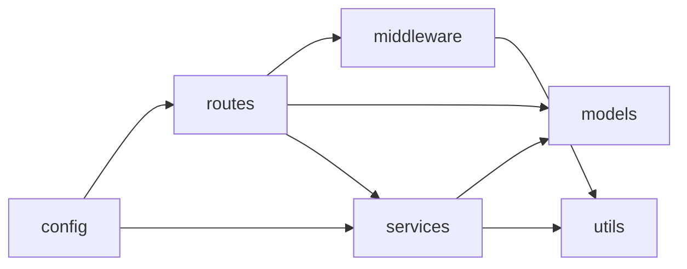
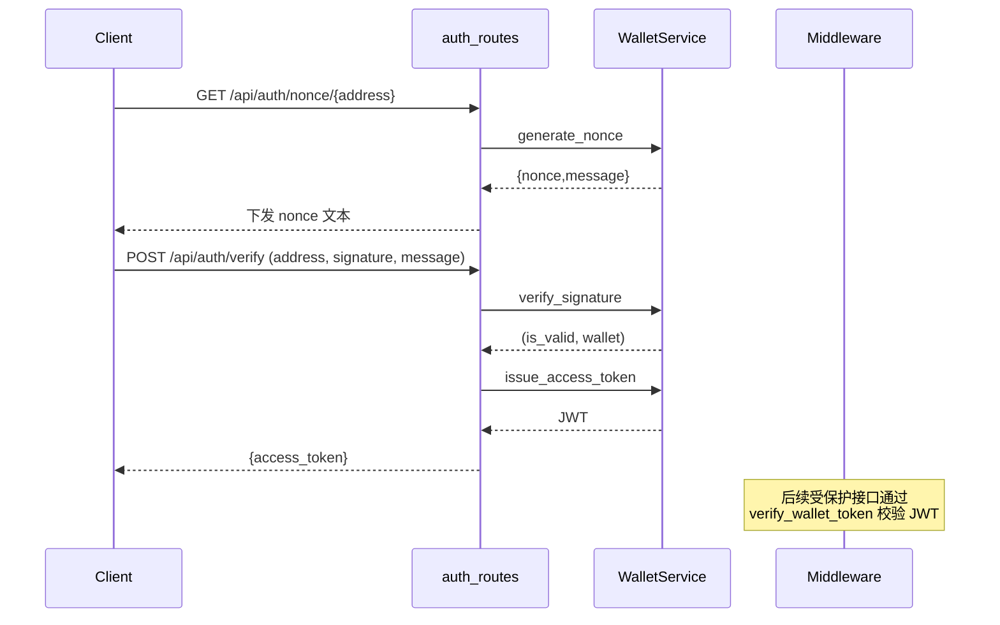
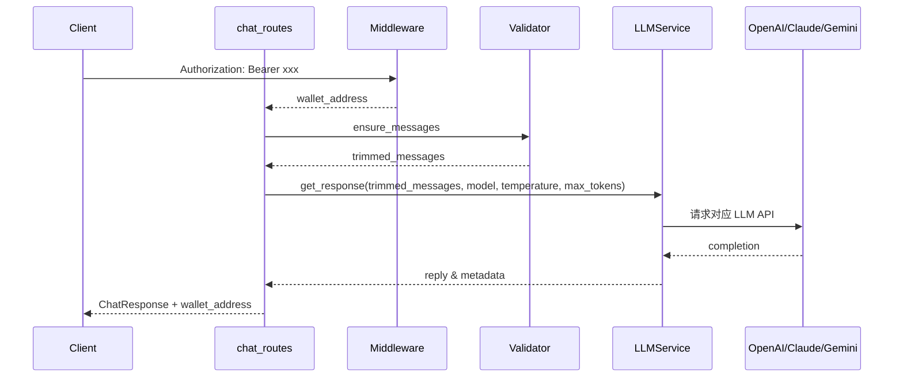
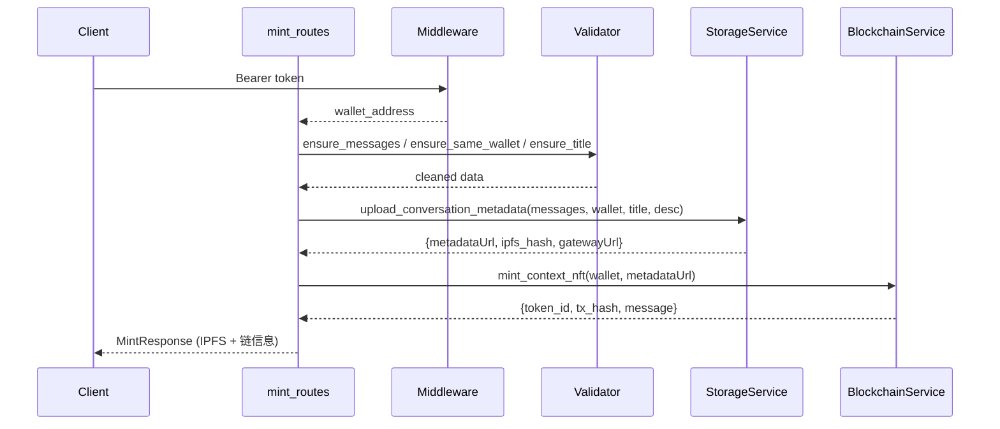

# 5017 Group Project

# 0.后端Quick Start
```bash
pip install fastapi uvicorn pydantic-settings openai anthropic google-generativeai ipfshttpclient web3 pyjwt
cd ./Project
uvicorn backend.main:app --reload
```

# 1.后端说明文档

## 1.1 架构概览

整体采用 FastAPI + 分层架构，核心分模块如下：

- `config`：集中配置与环境变量，提供 `settings` 单例。
- `models`：Pydantic 数据模型，`chat_models`/`user_models` 约束请求响应。
- `services`：业务逻辑层，封装 LLM、IPFS、链、钱包等外部依赖。
- `routes`：API 入口，组合中间件、验证、服务，面向前端。
- `middleware`：JWT 校验，保护需要登录的钱包能力。
- `utils`：通用工具，如签名校验、输入验证。



## 1.2 模块解析

**1.2.1 config**

- `Settings` 通过 `BaseSettings` 管理 APP 元信息、CORS、LLM/API Key、IPFS、链路参数、JWT 配置。
- `get_settings()` 使用 `lru_cache` 保证全局共享。

**1.2.2 models**

- `chat_models`：定义 `ChatMessage/ChatRequest/ChatResponse` 以及 NFT 相关 `MintRequest/MintResponse`，内含别名映射、参数校验、元数据字段。
- `user_models`：`WalletAuthRequest/Response`、`NonceResponse`、JWT 载荷等。

**1.2.3 services**

- `LLMService`：自动根据模型前缀路由到 OpenAI/Anthropic/Gemini，异步封装 SDK，统一返回 `reply/model_used/provider/latency/tokens_used`。
- `StorageService`：上传会话到 IPFS（或 mock），返回 `metadataUrl/ipfs_hash/gatewayUrl`，可检索会话。
- `BlockchainService`：伪造链上铸造逻辑，记录 token_id/tx_hash/网络信息，支持按钱包查询。
- `WalletService`：管理 nonce，封装签名校验与 JWT 签发。
- `services.__init__`：提供 `get_*_service` 以 FastAPI DI 复用实例。

**1.2.4 middleware**

- `verify_wallet_token`：抽取 `Authorization: Bearer <token>`，校验签名/过期，返回钱包地址。

**1.2.5 utils**

- `crypto_utils`：签名消息模板、地址规范化、签名校验。
- `validation`：对话长度截断、钱包一致性、标题限制等校验工具。

**1.2.6 routes**

- `auth_routes`：`/api/auth/nonce` 下发 nonce；`/api/auth/verify` 校验签名并颁发 JWT。
- `chat_routes`：`/api/chat` 依赖 JWT、校验消息长度，调用 `LLMService`。
- `mint_routes`：`/api/mints` 校验对话、标题、钱包一致性，串联 IPFS + 链服务返回 NFT 元信息。

## 1.3 核心链路

### 1.3.1 钱包认证



- `generate_nonce`：缓存 nonce 与地址，返回标准签名文本。
- `verify_signature`：比较 nonce 消息、调用 `crypto_utils.is_valid_signature`，消费 nonce。
- `issue_access_token`：按 `JWT_EXPIRATION_MINUTES` 生成短期 token。

### 1.3.2 多模型聊天



- 路由层拦截异常：验证失败 → 422，模型未配置 → 400，API 异常 → 500。
- `LLMService` 自动选择 provider，统计响应耗时与 token 使用，便于前端展示与监控。

### 1.3.3 会话铸造



- 与聊天复用 `ensure_messages`，保证上下文长度受控。
- `ensure_same_wallet` 让请求体里的地址与 JWT 一致，避免越权铸造。
- 伪链路输出 Token ID / Tx Hash，未来可替换为真实链上交互。

### 1.3.4 协作模式总结

1. **配置驱动**：所有模块从 `settings` 获取依赖参数（API Key、网关、模型默认值），保证环境一致。
2. **依赖注入**：路由通过 FastAPI `Depends` 注入服务与中间件，方便测试与实例复用。
3. **工具支撑**：`utils` 提供签名／输入验证，确保路由层只关注组合逻辑。
4. **模块协同**：
    - 认证 → 中间件 → 聊天/铸造：统一 JWT 流程。
    - 聊天/铸造共享 `ensure_messages`、`MAX_HISTORY_MESSAGES`，保证交互一致性。
    - 铸造流程联动 IPFS + 链服务，形成跨模块能力闭环。